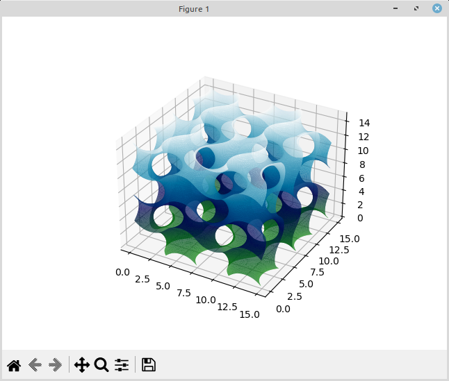
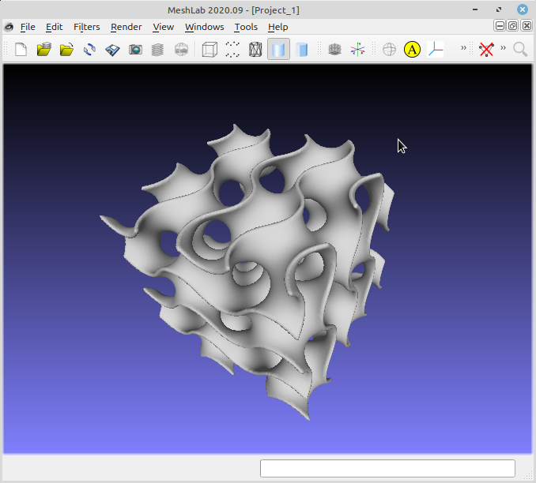
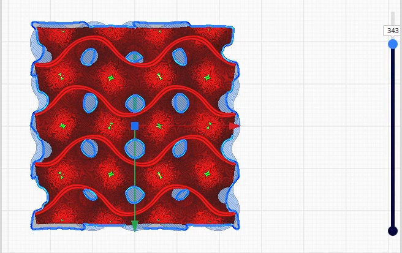
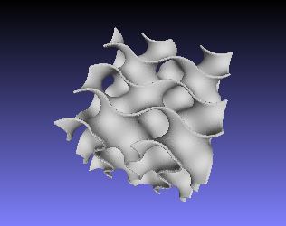
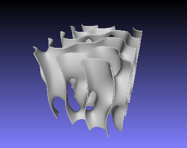
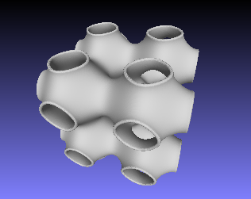
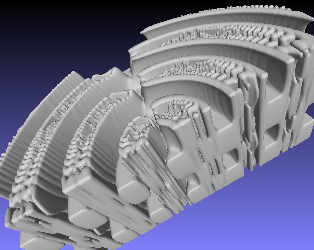
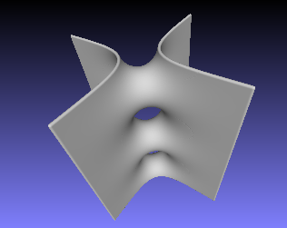

# Gyroid 3D Plot

Note: to clone this repo, you need _git lfs_, because generated STL files, which are big, have been committed.

## The Gyroid

The Gyroid has become quite famous in the 3D printing community, for being often
used as infill pattern.

To define a Gyroid:

- Take this _ℝ³ → ℝ_ function: _f(x, y, z) = cos(x) sin(y) + cos(y) sin(z) + cos(z) sin(x)_,
- the Gyroid is the surface where _f(x, y, z) = 0_.

## 3d Surfaces - `skimage` and `matplotlib`

Such kind of _ℝ³ → ℝ_ surfaces can be hard or impossible to express as convenient
and iterable parametric _ℝ² → ℝ³_ functions in the form _x = f<sub>x</sub>(u, v)_, _y = f<sub>y</sub>(u, v)_, _z = f<sub>z</sub>(u, v)_.

- So we are using a Python solver:
  [`vertices, faces, ... = skimage.measure.marching_cubes()`](https://scikit-image.org/docs/stable/auto_examples/edges/plot_marching_cubes.html#marching-cubes).

- The surface can be visualized by `matplotlib.pyplot.show()` as done in:

  ```
  ./gyroid.py -p  # compute surface and view it
  ```

  

  Visual inspection is not particularly smooth unless you have a very fast
  computer, so you're better off generating a volume and inspecting its STL
  export. See below.

## Turning a 3d Surface Into a Volume - `meshlib` and `meshlab`

In order to 3D print the surface, we have to give it a volume by adding some thickness.

- To this end, we're using
  [`meshlib.mrmeshpy.offsetMesh(offset=thickness)`](https://meshlib.io/feature/precision-mesh-offsetting-with-meshlib/).

  - Meshlib is free for education and evaluation.

  - As _meshlib_ and _skimage_ use incompatible formats, we're saving the
    surface computed by the former to a temporary STL file, read by the latter.

- We apply all the above and save the result as an STL file:

  ```
  ./gyroid.py -s
  ```

  and can view the result using e.g. `meshlab`.

  ```
  meshlab outputs/stl/gyroid.stl
  ```

  

# 3D Printing

You can use Cura or any other slicer.

- Follow [this link](./docs/videos/fig-gyroid-cura.mp4) to see a video of the successive
  layers.  
  

# Installation and Usage

## How to Install

1. Make sure you have `Python 3` installed.

2. Install the `make` commande. Example with Debian-based distros:

   ```
   sudo apt install make
   ```

   Other optional programs are `meshlab` and `cura` (or any other slicer).

3. For any OS having Python3, do:
   ```
   make venv
   . .venv/bin/activate
   make require
   ```

## How to Run

```
. .venv/bin/activate
./gyroid.py     # show options
./gyroid.py -p  # show surface in matplotlib; rotation/zoom net performant
./gyroid.py -s  # compute .stl file with thickness (saved to outputs/stl/)

```

# Other Included Surfaces

The surfaces provided in this repo are:
| Program | Description | |
| ---------------- | -------------------------------| - |
| `./gyroid.py` | The surface described above |  |
| `./lamella.py` | A surface accidentally created |  |
| `./multiple.py` | A collection of surfaces |  |
| `./organite.py` | An organic section |  |
| `./scherk-singly.py` | A Scherk surface | 
